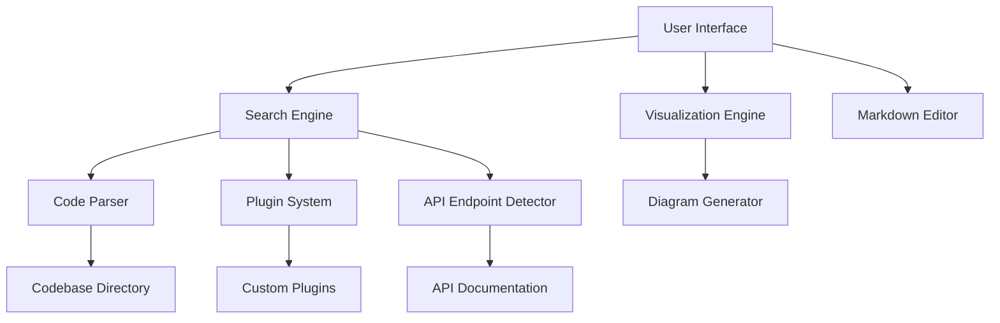

# CodeSeer

CodeSeer is an advanced code analysis and search platform designed to help developers explore, understand, and document complex codebases with ease. It combines powerful search, code intelligence, and visualization features, making it ideal for both individual developers and teams working with large or unfamiliar projects.

## Introduction

CodeSeer offers a streamlined environment for deep code exploration, search, and documentation. Whether you are onboarding to a new project, auditing legacy code, or seeking specific logic in a vast codebase, CodeSeer accelerates understanding and insight. Its modular architecture ensures extensibility and adaptability to various workflows and programming languages.

## Features

- **Intelligent Code Search:** Quickly find classes, functions, files, and references across the entire codebase.
- **Contextual Navigation:** Jump directly to definitions, usages, or related symbols for efficient code exploration.
- **Rich Documentation Tools:** Generate and maintain comprehensive documentation with integrated markdown and visualization support.
- **Code Visualization:** Visualize code structure, dependencies, and data flows using interactive diagrams.
- **API Endpoint Discovery:** Automatically detect and document HTTP API endpoints, including request/response formats.
- **Extensible Plugin System:** Integrate custom search strategies, language support, and analysis tools.
- **User-friendly UI:** Responsive, intuitive interface designed for speed and clarity.

## Requirements

To run CodeSeer, ensure your environment meets the following prerequisites:

- **Node.js** version 16 or later
- **npm** (Node Package Manager)
- **Git** for repository cloning and version control
- **Supported OS:** macOS, Linux, or Windows
- **Supported Browsers:** Latest versions of Chrome, Firefox, or Edge (for the web interface)
- **Optional:** Docker (for containerized deployment)

## Configuration

Before using CodeSeer, configure your environment and settings:

1. **Clone the Repository:**
   ```bash
   git clone https://github.com/RajX-dev/codeseer.git
   cd codeseer
   ```

2. **Install Dependencies:**
   ```bash
   npm install
   ```

3. **Environment Variables:**
   Create a `.env` file in the root directory and specify the following variables as needed:
   ```
   PORT=3000
   CODEBASE_DIR=/path/to/your/codebase
   DATABASE_URL=mongodb://localhost:27017/codeseer
   ```

4. **Configuration File:**
   Adjust `config.json` or other configuration files as required for your environment, plugins, or integration needs.

5. **Optional:** Set up Docker for a containerized deployment:
   ```bash
   docker-compose up -d
   ```

## Usage

Follow these steps to use CodeSeer for code analysis and documentation:

### 1. Start the Server

Run the development server:

```bash
npm start
```

The server will launch on the port specified in your `.env` file (default is `3000`).

### 2. Access the Web Interface

Open your browser and navigate to:

```
http://localhost:3000
```

### 3. Explore and Search Code

- Use the search bar to find symbols, files, or keywords.
- Click on search results to view code with syntax highlighting and in-line references.
- Navigate using the sidebar to browse file structure and project components.

### 4. Visualize Code Structure

- Use the visualization panel to generate and interact with diagrams, such as class hierarchies, dependency graphs, or data flows.
- Export diagrams in supported formats for inclusion in documentation.

### 5. Discover and Document API Endpoints

- CodeSeer automatically detects API endpoints defined in your codebase.
- View auto-generated documentation for each endpoint, including methods, parameters, and example requests/responses.

### 6. Generate and Edit Documentation

- Use the integrated markdown editor to create or update project documentation.
- Link documentation entries to specific files, functions, or modules for context-rich references.

### 7. Extend with Plugins

- Add or configure plugins via the settings or `plugins` directory.
- Develop custom plugins for extended language support, custom analysis, or integration with external tools.

---

## Visual Overview

Below is a high-level diagram of the core architecture and workflow within CodeSeer:



---

## Support

For issues, questions, or feature requests, please open an issue on the [GitHub repository](https://github.com/RajX-dev/codeseer/issues).

---

## License

This project is licensed under the MIT License. See the `LICENSE` file for details.
